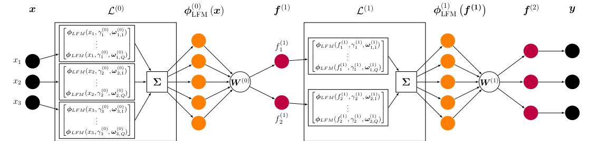
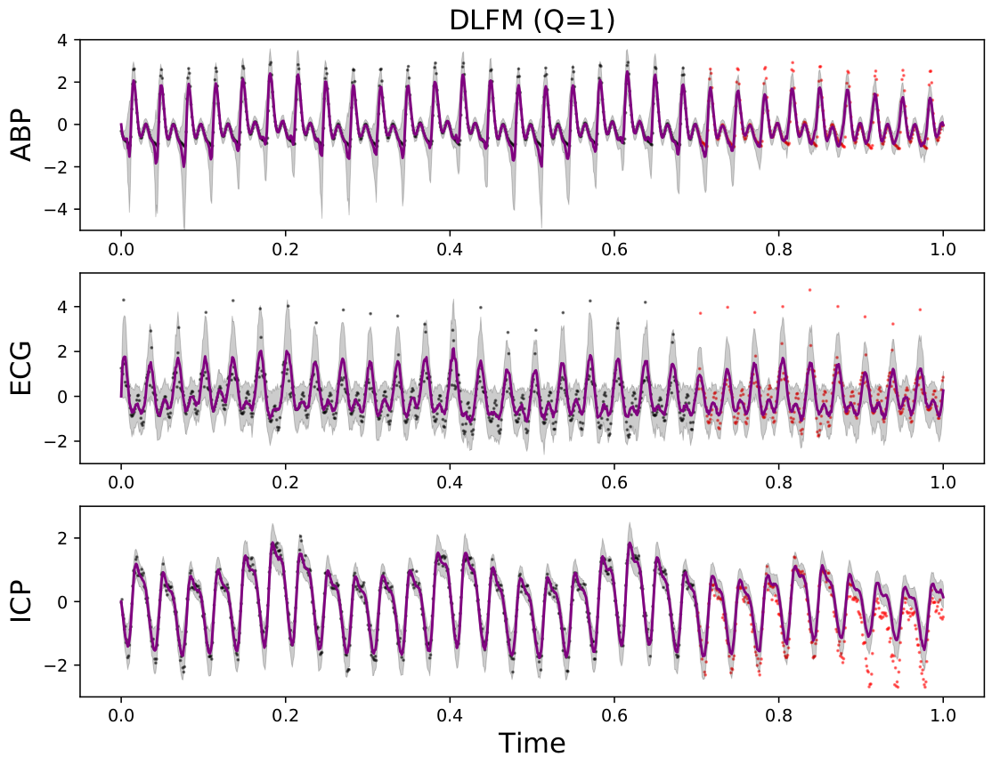

# Deep Latent Force Models

This repository contains a PyTorch implementation of the *deep latent force model* (DLFM), presented in the paper, *Compositional Modeling of Nonlinear Dynamical Systems with ODE-based Random Features*, [published at NeurIPS 2021](https://proceedings.neurips.cc/paper/2021/hash/72fe6f9fdab5f4d465ac6da028e4544c-Abstract.html).  

The DLFM takes the form of a deep Gaussian process with random feature expansions, but with the random Fourier features in question derived from a physics-informed ODE1 LFM kernel, rather than a more general choice (such as the exponentiated quadratic kernel).



These compositions of physics-informed random features allow us to model nonlinearities in multivariate dynamical systems with a sound quantification of uncertainty and the ability to extrapolate effectively. The plot below shows DLFM predictions on a highly nonlinear multivariate time series, extracted from the [CHARIS PhysioNet dataset](https://physionet.org/content/charisdb/1.0.0/); note the ability of the model to extrapolate beyond the training regime which ends at t=0.7.



## Usage

`requirements.txt` contains the small list of packages required to run `toy_demo.py`, which is identical to the toy data scenario described in our paper.

## Citation

```
@inproceedings{mcdonald2021compositional,
  title={Compositional Modeling of Nonlinear Dynamical Systems with ODE-based Random Features},
  author={McDonald, Thomas M and {\'A}lvarez, Mauricio A},
  booktitle={Advances in Neural Information Processing Systems},
  year={2021}
}
```
